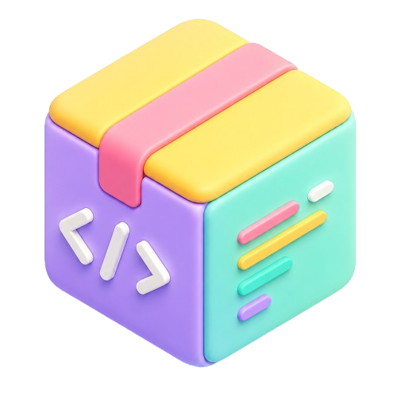

<p align="center">
  
</p>

<h1 align="center">CodeV</h1>

<p align="center">面向 AI Coding 场景的一站式桌面工具工作台</p>

## 项目简介

CodeV 是一个基于 Electron、React、TypeScript 与 Vite 构建的桌面应用，聚合了 AI 编程工具、代理/网络工具、设计工具与终端工具，提供统一的检测、下载、启动、终端接入和配置管理能力，帮助你在一个桌面工作台里完成常用开发工具的组织与调度。

## 功能特性

### 1. 工具工作台

- 支持按分类浏览工具，内置 `AI 编程`、`代理/网络`、`设计工具`、`终端` 等分组。
- 支持关键字搜索，可按名称、分类、说明和安装路径快速筛选工具。
- 支持扫描安装目录，自动检测本地工具是否已安装。
- 支持直接启动程序，并对已运行的 GUI 程序尝试聚焦。
- 支持新增、编辑和维护工具信息，包括名称、说明、分类、图标、启动参数和环境变量。

### 2. 内置终端

- 集成 `xterm.js`，可在应用内直接创建终端会话。
- 支持为指定工具新建终端，并自动注入全局环境变量、工具环境变量和代理变量。
- 支持多会话切换、关闭、复制选中内容和粘贴剪贴板内容。
- 支持 GPU 渲染开关与主题联动，兼顾性能与显示效果。

### 3. 下载管理

- 支持从 GitHub Release 快速加入下载任务。
- 支持下载任务列表、进度展示、取消任务和清理已完成任务。
- 支持打开下载目录，方便查看安装包与缓存文件。
- 支持配置并发下载数量、临时目录和下载完成提醒。

### 4. 设置中心

- 支持浅色/深色主题切换。
- 支持全局代理配置，可配置 `HTTP` 或 `SOCKS5` 代理。
- 支持全局环境变量与按工具隔离的环境变量管理。
- 支持终端相关设置与高级行为配置。
- 支持关闭窗口最小化到托盘、日志等级和开机自启等桌面端选项。

### 5. 桌面能力

- 支持系统托盘驻留，适合常驻后台使用。
- 支持检查应用更新。
- 支持本地文件选择与工具图标导入。
- 支持通过 Electron IPC 打通主进程与渲染进程能力。

## 内置工具示例

项目默认预置了一批常用工具元数据，开箱即可用于扫描或下载，例如：

- AI 编程：`Claude Code`、`OpenCode`、`Codex`
- 代理/网络：`CC Switch`、`codex-proxy`、`CLIProxy`、`ZeroLimit`、`ProxyPilot`
- 设计工具：`OpenDesign`
- 终端：`WezTerm`、`Tabby`、`Git`

## 页面说明

- `首页`：查看分类、搜索工具、扫描安装状态、直接启动工具或进入终端。
- `下载管理`：统一管理 GitHub Release 下载任务。
- `终端`：管理内置终端会话。
- `设置`：管理主题、下载、代理、环境变量与高级配置。

## 技术栈

- Electron Forge
- React 19
- TypeScript
- Vite
- Tailwind CSS
- Radix UI
- Zustand
- xterm.js
- Framer Motion

## 快速开始

### 1. 安装依赖

```bash
npm install
```

### 2. 启动开发环境

```bash
npm run start
```

### 3. 代码检查

```bash
npm run lint
```

### 4. 打包应用

```bash
npm run package
```

或生成发行包：

```bash
npm run make
```

## 项目结构

```text
src/
├─ main/                 # Electron 主进程与系统能力
│  ├─ ipc/               # IPC 通信注册
│  └─ services/          # 下载、托盘、终端、更新等服务
├─ renderer/             # React 渲染层
│  ├─ state/             # Zustand 状态管理
│  └─ ui/                # 页面与布局组件
├─ shared/               # 主进程与渲染进程共享类型和默认配置
├─ preload.ts            # 预加载桥接层
└─ main.ts               # Electron 应用入口
```

## 适用场景

- 统一管理本地 AI Coding 工具与辅助工具
- 为命令行工具配置独立代理与环境变量
- 通过桌面工作台快速启动、下载和维护开发工具
- 将常用 CLI 工具纳入同一个内置终端体系

## 许可证

本项目采用 MIT 许可证，当前许可证信息定义在 `package.json` 中。
